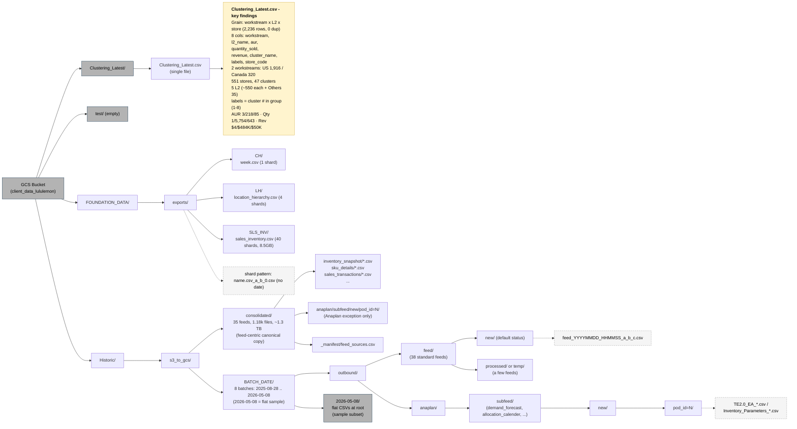

# gs://client_data_lululemon/ - GCS bucket structure

Render: Cursor markdown preview (Mermaid supported), GitHub, or Notion.

```mermaid
flowchart LR
  bucket["GCS Bucket<br/>(client_data_lululemon)"]:::grey

  bucket --> clustering["Clustering_Latest/"]:::grey
  bucket --> testFolder["test/ (empty)"]:::grey
  bucket --> foundation["FOUNDATION_DATA/"]
  bucket --> historic["Historic/"]

  %% Clustering branch
  clustering --> clustcsv["Clustering_Latest.csv<br/>(single file)"]
  clustcsv --> findings["<b>Clustering_Latest.csv - key findings</b><br/>Grain: workstream x L2 x store (2,236 rows, 0 dup)<br/>8 cols: workstream, l2_name, aur, quantity_sold,<br/>revenue, cluster_name, labels, store_code<br/>2 workstreams: US 1,916 / Canada 320<br/>551 stores, 47 clusters<br/>5 L2 (~550 each + Others 35)<br/>labels = cluster # in group (1-8)<br/>AUR 3/218/85 · Qty 1/5,754/643 · Rev $4/$484K/$50K"]:::note

  %% Foundation branch
  foundation --> exports["exports/"]
  exports --> ch["CH/<br/>week.csv (1 shard)"]
  exports --> lh["LH/<br/>location_hierarchy.csv (4 shards)"]
  exports --> slsinv["SLS_INV/<br/>sales_inventory.csv (40 shards, 8.5GB)"]
  exports -.-> foundnote["shard pattern: name.csv_a_b_0.csv (no date)"]:::file

  %% Historic branch
  historic --> s3["s3_to_gcs/"]
  s3 --> batch["BATCH_DATE/<br/>8 batches: 2025-08-28 .. 2026-05-08<br/>(2026-05-08 = flat sample)"]
  s3 --> consolidated["consolidated/<br/>35 feeds, 1.18k files, ~1.3 TB<br/>(feed-centric canonical copy)"]
  consolidated --> stdCons["inventory_snapshot/*.csv<br/>sku_details/*.csv<br/>sales_transactions/*.csv<br/>..."]
  consolidated --> anaCons["anaplan/subfeed/new/pod_id=N/<br/>(Anaplan exception only)"]
  consolidated --> manifest["_manifest/feed_sources.csv"]
  batch --> outbound["outbound/"]
  batch --> sampleFlat["2026-05-08/<br/>flat CSVs at root<br/>(sample subset)"]:::grey
  outbound --> feed["feed/<br/>(38 standard feeds)"]
  outbound --> anaplan["anaplan/"]
  feed --> statusnew["new/ (default status)"]
  feed --> statusproc["processed/ or temp/<br/>(a few feeds)"]
  statusnew -.-> filepat["feed_YYYYMMDD_HHMMSS_a_b_c.csv"]:::file
  anaplan --> subfeed["subfeed/<br/>(demand_forecast, allocation_calender, ...)"]
  subfeed --> ananew["new/"]
  ananew --> pod["pod_id=N/"]
  pod -.-> anafile["TE2.0_EA_*.csv /<br/>Inventory_Parameters_*.csv"]:::file

  classDef grey fill:#B3B3B3,stroke:#23445D,color:#000;
  classDef note fill:#FFF4CE,stroke:#D6B656,color:#000,text-align:left;
  classDef file fill:#F5F5F5,stroke:#999,stroke-dasharray:4 3,color:#000;
```
